<h1 align="center">Hi 👋, I'm Niraj Singh</h1>

<h3 align="center">
  B.Tech CSE (AI & ML) Student · Aspiring Full-Stack Developer · Problem Solver
</h3>

  

  

<h2 align="center">👨‍💻 About Me</h2>

<ul>
  <li>💻 Building a strong foundation in full-stack development</li>
  <li>🤖 Exploring AI/ML and practical problem-solving</li>
  <li>🌱 Learning through projects, coding practice, and collaboration</li>
  <li>🤝 Open to meaningful projects, open-source contributions, and new ideas</li>
</ul>

<h2 align="center">🚀 Tech Stack</h2>

<h3 align="center">💻 Languages</h3>

  &nbsp;
  
  &nbsp;
  
  &nbsp;
  
  &nbsp;
  
  &nbsp;
  
  &nbsp;
  
    
  
  &nbsp;
  
  &nbsp;
  
  &nbsp;
  
  &nbsp;
  

<h3 align="center">🛠️ Tools</h3>

  
  &nbsp;
  
  &nbsp;
  
  &nbsp;
  
  &nbsp;
  
  &nbsp;
  
  &nbsp;
  

<h2 align="center">🎯 Current Focus</h2>

<ul>
  <li>Strengthening full-stack development fundamentals</li>
  <li>Learning AI/ML concepts through practical projects</li>
  <li>Improving data structures and problem-solving skills</li>
  <li>Building internship-ready portfolio projects</li>
</ul>

<blockquote>
  I enjoy learning by building practical solutions that make technology useful.
</blockquote>

<h2 align="center">📈 Contribution Graph</h2>

  

<h2 align="center">🤝 Connect With Me</h2>

  &nbsp;&nbsp;&nbsp;
  &nbsp;&nbsp;&nbsp;
  &nbsp;&nbsp;&nbsp;
  &nbsp;&nbsp;&nbsp;
  

  

